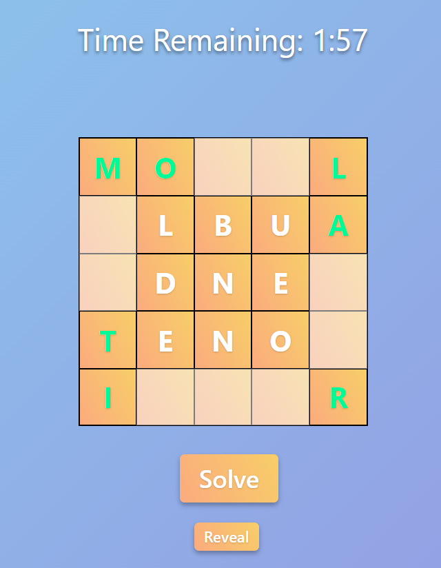
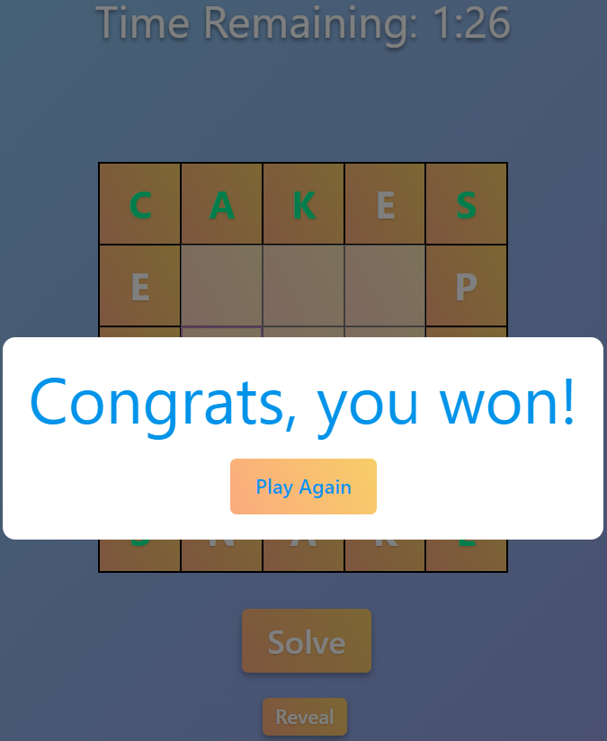
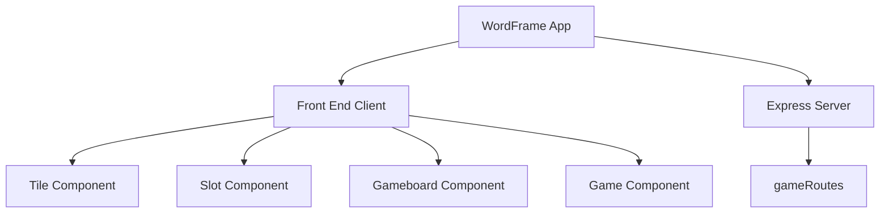

# WordFrame

WordFrame is a web-based word puzzle game. It offers a unique word-guessing experience where players interact with a grid of scrambled letters to form words. WordFrame has over 600+ solution sets for improved replay value.

## Game Description
The game board consists of a 5x5 grid with nine movable letter tiles in the center. Four corner tiles and three randomly selected tiles are revealed in their correct position. Swap the movable letter tiles by clicking on a pair of them. Unscramble the four words in the outermost slots within **two minutes** to solve the **WordFrame**!
A reveal button was added to assist players with solving puzzles.

## Software 
The React Client uses an api call to the Express Server to retrieve a random four word solution set (words, letter tiles, corner tiles, answer array).
The api call occurs when the 'Start' or 'Play Again' buttons are pressed on one of the modal pop-ups.
The retrieved data is used to position the 9 moveable tiles in the center of the gameboard, the four fixed corner tiles, and three randomly revealed tiles.

## Technologies Used

  
  
  
  
  

# Setup and Installation
To run WordFrame on your local machine, follow these steps:
1. Clone the Repository: Clone the WordFrame repository to your local machine.
2. Install Dependencies: Navigate to the project directory and run npm install to install the necessary dependencies.
3. Start the Application: Run npm run dev to start the application. It will be available at http://localhost:5000.

### Contributing
Contributions to WordFrame are always welcome, whether it be improvements to the codebase, bug reports, or new feature suggestions. If you wish to contribute, please follow these steps:
1. Fork the repository.
2. Create a new branch for your feature or fix.
3. Commit your changes and push them to your fork.
4. Submit a pull request with a clear description of your changes.
   
## License
WordFrame is released under the MIT License.
