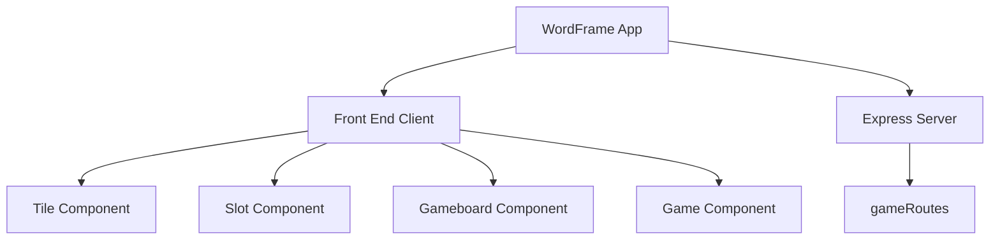

# WordFrame

WordFrame is a captivating and challenging web-based word puzzle game. It offers a unique word-guessing experience where players interact with a grid of scrambled letters to form words.

## Game Description
In WordFrame, players are presented with a 5x5 grid filled with scrambled letters. Each day, four new words are chosen and their letters are randomly distributed across the grid. The player's task is to reorganize these letters to form the correct words.

The game's interface includes draggable tiles and slots where these tiles can be placed. When a player drags a letter onto a slot, it grows to fill the slot, visually assisting in word formation. The words are formed around the edges of the grid, with each side representing one word. Adjacent sides share a common letter, adding an extra layer of complexity and fun to the puzzle.

When a correct word is guessed, the font color of the tiles changes to teal, providing immediate feedback on the player's progress.

## Technologies Used

  
  
  
  
  

# Setup and Installation
To run WordFrame on your local machine, follow these steps:
1. Clone the Repository: Clone the WordFrame repository to your local machine.
2. Install Dependencies: Navigate to the project directory and run npm install to install the necessary dependencies.
3. Start the Application: Run npm run dev to start the application. It will be available at http://localhost:3000.

### Contributing
Contributions to WordFrame are always welcome, whether it be improvements to the codebase, bug reports, or new feature suggestions. If you wish to contribute, please follow these steps:
1. Fork the repository.
2. Create a new branch for your feature or fix.
3. Commit your changes and push them to your fork.
4. Submit a pull request with a clear description of your changes.
   
## License
WordFrame is released under the MIT License.
